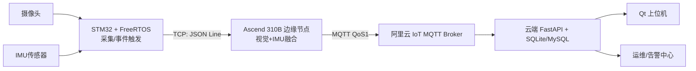
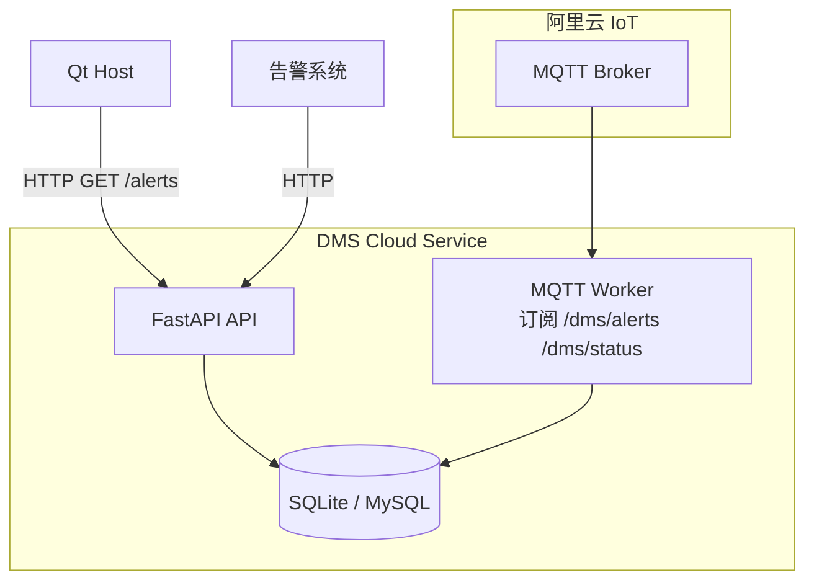
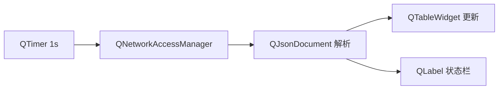

# DMS 端-边-云实装部署指南（STM32 + Ascend 310B + 阿里云 MQTT + Qt）

本文档给出一个可落地的工程部署方案，针对资源受限 MCU 与车载边缘计算场景。

## 1. 总体架构图（项目实例图）



## 2. 云端链路图（云端图）



## 3. Qt 展示链路图（QT 图）



## 4. Ascend 310B 部署建议

1. 将边缘服务部署在 310B 车载节点，建议使用 `systemd` 拉起。
2. 推理模块建议拆为独立进程（例如 CANN + ACL），通过本地 IPC/共享内存向 `edge_server.py` 输出统计特征。
3. 为避免 CPU 抢占，采集线程、推理线程、网络线程分离，网络上报保持异步。
4. 当模型推理异常时，边缘端退化到 IMU 风险评分，保障主判断可用。

## 5. 阿里云 MQTT 对接参数

边缘端支持 HTTP/MQTT 双上行：

- `EDGE_UPLINK=http`：本地联调，直接 POST 云端接口。
- `EDGE_UPLINK=mqtt`：上车部署，通过 MQTT 发往云端。

典型环境变量：

```bash
export EDGE_UPLINK=mqtt
export MQTT_HOST=iot-xxxx.mqtt.iothub.aliyuncs.com
export MQTT_PORT=1883
export MQTT_USERNAME=<device_name>&<product_key>
export MQTT_PASSWORD=<mqtt_password>
export MQTT_ALERT_TOPIC=/dms/alerts
export MQTT_STATUS_TOPIC=/dms/status
```

云端启用 MQTT 接收：

```bash
export MQTT_ENABLE=1
export MQTT_HOST=iot-xxxx.mqtt.iothub.aliyuncs.com
export MQTT_PORT=1883
export MQTT_USERNAME=<consumer>
export MQTT_PASSWORD=<password>
uvicorn cloud_service.app:app --host 0.0.0.0 --port 8000
```

## 6. MCU 侧资源优化建议

- 采集、IMU、上报任务分级：采集/IMU 高优先级，上报中优先级，健康监控低优先级。
- DMA 双缓冲 + 队列解耦，避免图像采集阻塞。
- 所有消息结构定长化，优先静态内存，避免堆碎片。
- MQTT 发送采用批量窗口和退避重连，网络异常时优先保留关键告警。
